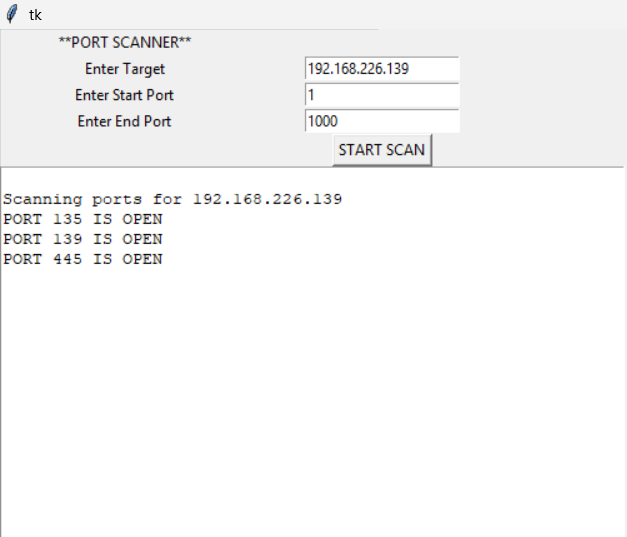

# 🔐 Python Port Scanner

A simple TCP Port Scanner built with Python and Tkinter.

This project allows users to enter a target IP address or hostname and specify a range of ports to scan. The scanner attempts to establish TCP connections to the specified ports and displays the open ports in a graphical interface.

## 🚀 Features

- 🔍 Scan a target IP address or hostname
- 🔢 Specify a custom start and end port
- 🌐 Resolve hostnames to IP addresses
- 🔌 TCP port scanning using Python sockets
- ⚡ Multithreaded scanning
- ⏱️ Connection timeout handling
- ✅ Port range validation
- 🖥️ Simple Tkinter graphical interface
- 📋 Displays open ports in the application

## 🛠️ Technologies Used

- Python 3
- Socket Programming
- Tkinter
- Threading

## 📂 Project Structure

```text
PORT_SCANNER/
│
├── port_scanner.py
├── README.md
├── .gitignore
└── screenshot.png
```

## 🚀 How to Run

### 1. Clone the repository

```bash
git clone YOUR_REPOSITORY_URL
```

### 2. Open the project

```bash
cd python-port-scanner
```

### 3. Run the program

```bash
python port_scanner.py
```

On some systems, you may need:

```bash
python3 port_scanner.py
```

## 💻 How to Use

1. Enter the target IP address or hostname.
2. Enter the starting port.
3. Enter the ending port.
4. Click **START SCAN**.
5. The scanner will display open TCP ports in the output area.

### Example

```text
Target: 127.0.0.1
Start Port: 1
End Port: 100
```

Example output:

```text
Scanning ports for 127.0.0.1

PORT 22 IS OPEN
PORT 80 IS OPEN
```

## 🧠 How It Works

The scanner uses Python's `socket` module to attempt TCP connections to each port.

The `connect_ex()` function is used to determine whether a connection can be established.

```python
conn = s.connect_ex((target, port))

if conn == 0:
    output.insert(tk.END, "\nPORT {} IS OPEN".format(port))
```

The scanner also uses Python's `threading` module so that multiple ports can be scanned concurrently.

## ⚠️ Limitations

- The current implementation creates a separate thread for each port.
- Scanning a very large port range can create a large number of threads.
- The scanner currently identifies open TCP ports but does not perform service or banner detection.
- The GUI does not currently show scan progress.

## 🔮 Future Improvements

- Use a controlled thread pool instead of creating one thread per port
- Add a progress bar
- Add a **Clear Output** button
- Add scan status
- Detect common services running on open ports
- Add service/banner detection
- Improve the graphical interface
- Add support for exporting scan results

## 📸 Screenshot



## 🔐 Ethical & Legal Use

This tool is intended for educational purposes and authorized security testing.

Only scan systems, networks, and devices that you own or have explicit permission to test.

Unauthorized port scanning may violate laws, regulations, or network policies.

## 👨‍💻 Author

Created as a cybersecurity and Python learning project.